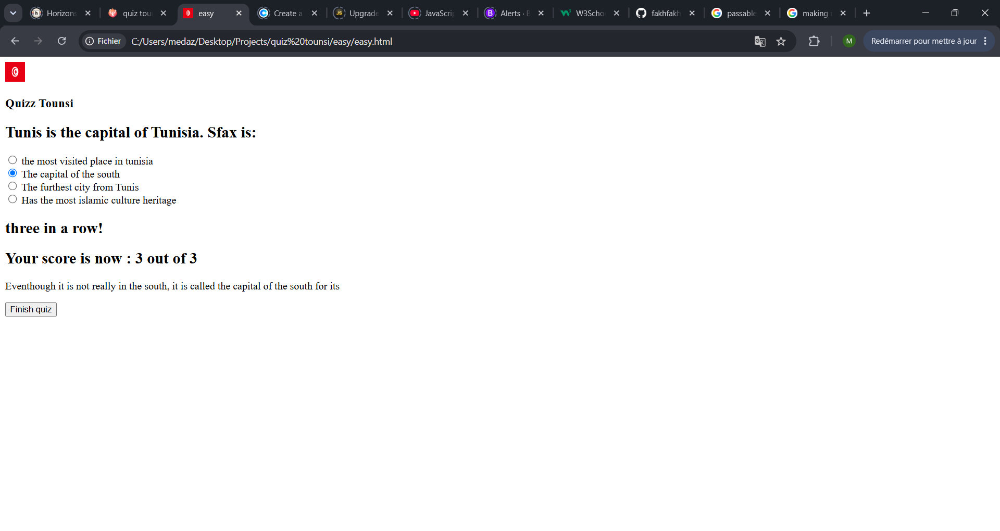
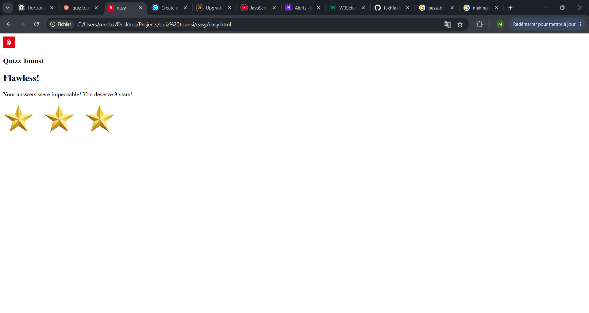
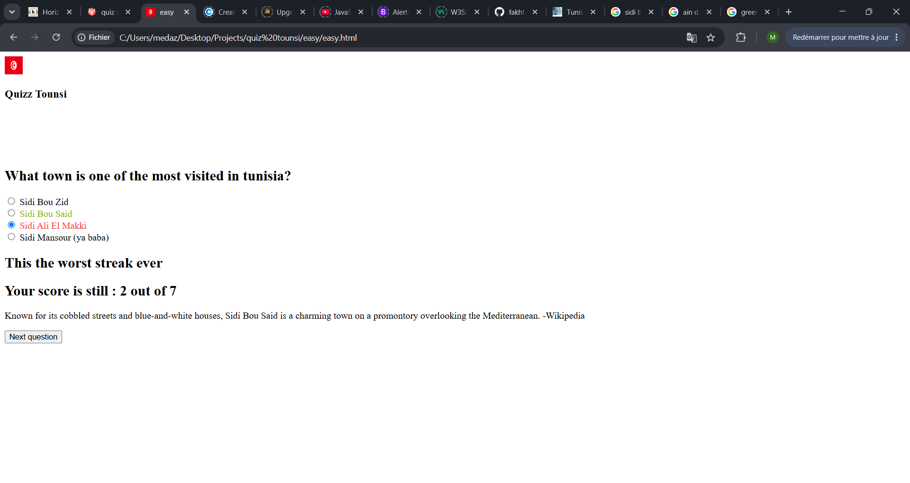

# June 20th: Menu

I made the skeleton of the website and chose the background color. 
Then I made buttons for each level that drop when you hover on the play button. 
It took too much time because I had to learn how to use functions.

**Total time spent: 2h 24m 46s**

# June 21st : Fonctionnal menu & beginning to make the quiz

I made an info button to know about the quiz and linked all the levels to their respective pages. Now that the menu is done (except for the styling part which I am leaving to the end), I went to build the HTML skeleton of the "easy" page and started with the javascript.

**Total time spent: 1h 2m 59s**

# June 22nd : Making the quiz work

I added a lot of paragraphs and titles concerning the results for each question. I also completed the load question function and made it functionnal (lol). Besides that, I added a verification function that compares the answer you selected with the correct one and updates your score, makes comments and explains each answer. I then had to make a 'next question' button, because when I added other questions (for testing so don't laugh at their stupidity ToT), it sticks to the same question. In summary, a lot of '.style.display's, a lot of constants and a LOT of errors later, the quiz is somewhat functionning! 

**Total time spent: 1h 55m 59s**

# June 23rd : Quizz Finish and comments

I added a finish quiz button and made the function to make it end the quiz and give the user's results. I also added 3 stars and 3 black and white stars so that the user's scroe takes the form of stars. I had a problem with the stars though cause I couldn't put them in the same line, and after a bit of research I discovered the existance of something called a flexbox. I don't know much about for now but it is a life saver. Then I added a lot of comments. I made the quiz a little provocative when you do a long streak without winnig but it gives you some nice comments when you do a good streak. It also gives feedback according to the score.

**Total time spent: 1h 46m 14s**

# June 24th : 

I made some questions concerning geography, history, culture and more, and I wrote some explainations to explain the answers. I also made it so that the True answer always turns green after your choice, and if you're wrong, your choice will turn red. That was so difficult to do but with a lot of documentation, it works just fine now!

**Total time spent: 1h 17m 7s**