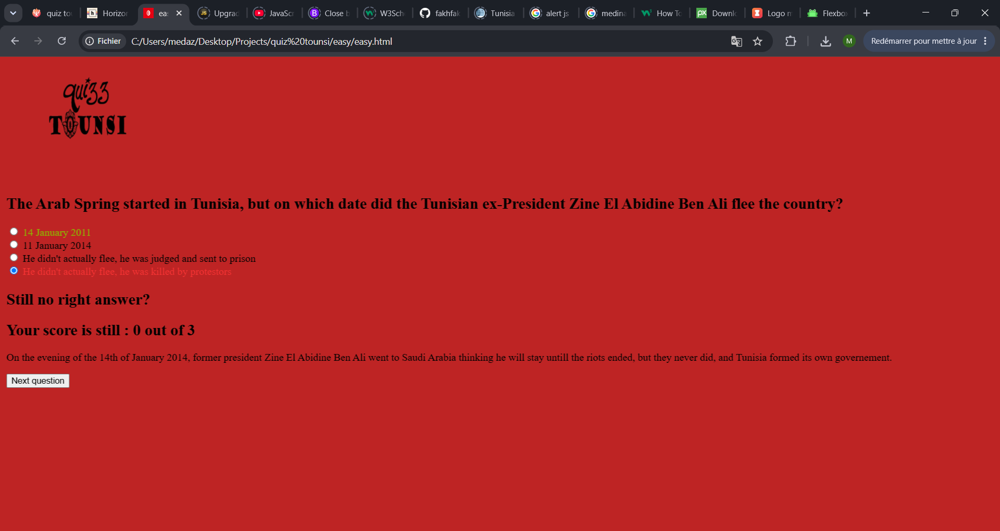
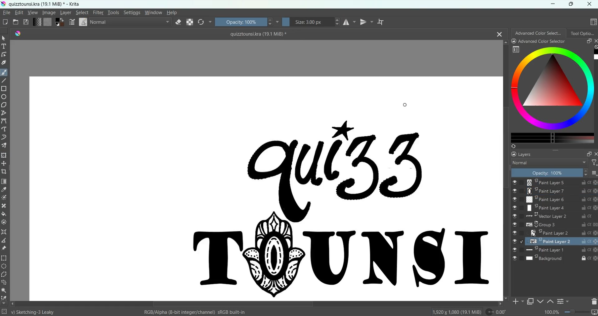
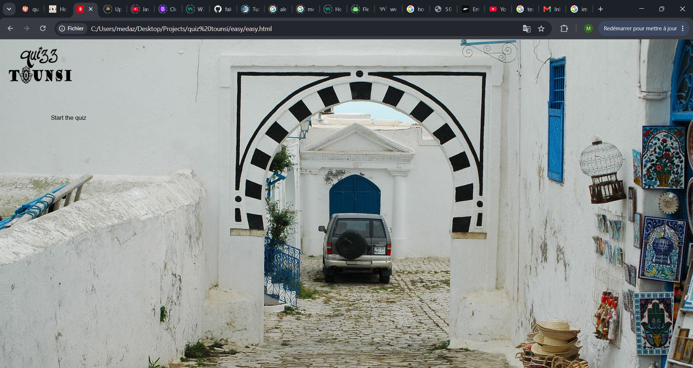
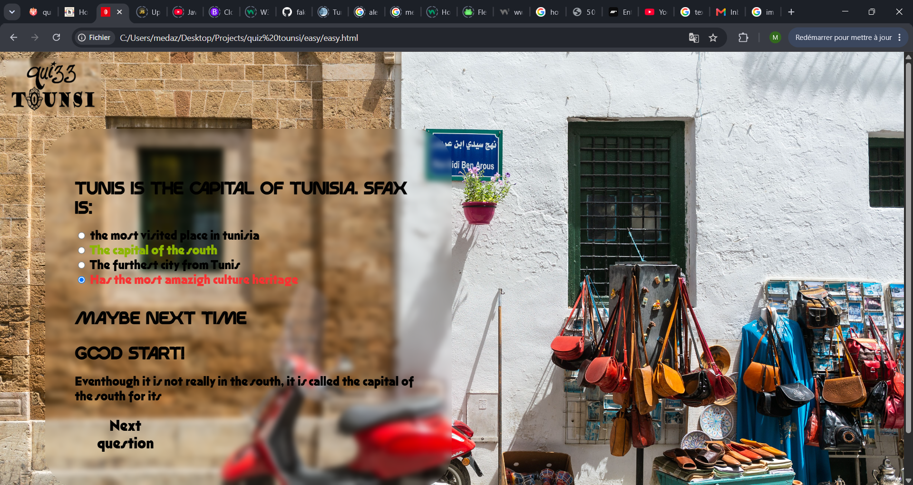
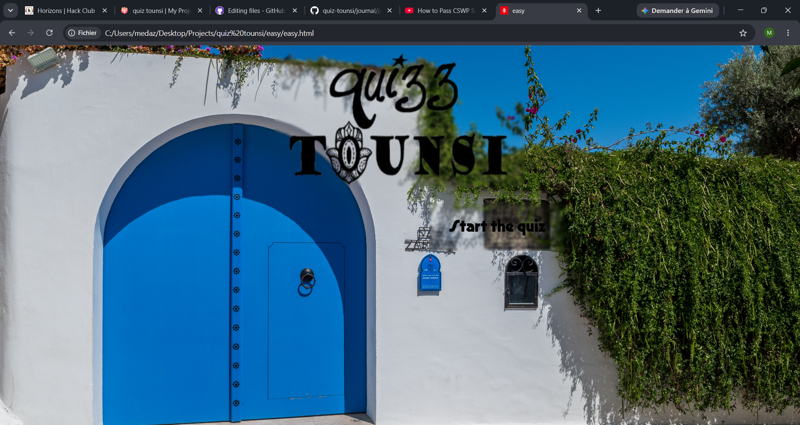

# June 20th: Menu

I made the skeleton of the website and chose the background color. 
Then I made buttons for each level that drop when you hover on the play button. 
It took too much time because I had to learn how to use functions.

**Total time spent: 2h 24m 46s**

# June 21st : Fonctionnal menu & beginning to make the quiz

I made an info button to know about the quiz and linked all the levels to their respective pages. Now that the menu is done (except for the styling part which I am leaving to the end), I went to build the HTML skeleton of the "easy" page and started with the javascript.

**Total time spent: 1h 2m 59s**

# June 22nd : Making the quiz work

I added a lot of paragraphs and titles concerning the results for each question. I also completed the load question function and made it functionnal (lol). Besides that, I added a verification function that compares the answer you selected with the correct one and updates your score, makes comments and explains each answer. I then had to make a 'next question' button, because when I added other questions (for testing so don't laugh at their stupidity ToT), it sticks to the same question. In summary, a lot of '.style.display's, a lot of constants and a LOT of errors later, the quiz is somewhat functionning! 

**Total time spent: 1h 55m 59s**

# June 23rd : Quizz Finish and comments

I added a finish quiz button and made the function to make it end the quiz and give the user's results. I also added 3 stars and 3 black and white stars so that the user's scroe takes the form of stars. I had a problem with the stars though cause I couldn't put them in the same line, and after a bit of research I discovered the existance of something called a flexbox. I don't know much about for now but it is a life saver. Then I added a lot of comments. I made the quiz a little provocative when you do a long streak without winnig but it gives you some nice comments when you do a good streak. It also gives feedback according to the score.

**Total time spent: 1h 46m 14s**

# June 24th : Making the 'easy' questions and changing the answers colors 

I made some questions concerning geography, history, culture and more, and I wrote some explainations to explain the answers. I also made it so that the True answer always turns green after your choice, and if you're wrong, your choice will turn red. That was so difficult to do but it works just fine now!

**Total time spent: 1h 17m 7s**

# June 25th : Wrong answer animations

I started by making an alert when the user doesn't choose an option. I had a problem where the stars division took space even when the stars aren't displaying, and after searching, I remebered I had a css file where I had specified the dimentions of the divison. When I removed that line of code, it worked! Then I wanted to have a screenshake along with the wrong answer verdict, and while a lot of websites gave hard-to-understand solutions that don't even work, I found a website called w3schools that showed me how to manually make the animation by making a new class and defining what it would do in the css file using @keyframes. Now the screen shake animation is smooth as butter and bug free! I also wanted to make the background momentarily turn red when an answer is wrong, and that was also painful to do but I solved it with a little help from friend cause I didn't find the documentation necessary. (I couldn't get a screenshot of the animation obviously but you can see that it's slightly blurred from the shake)

**Total time spent: 1h 40m 39s**

# June 25th : Logo making

I wanted to make a logo that contained the cressent and the star from the country's flag but it wasn't aesthetic enough no matter how I tried to make it better so I dropped the design and went for two different fonts while replacing the 'o' from tounsi with a khomsa which is a palm-shaped traditionnal amulet. 

**Total time spent: 43m 39s**

# June 26th and 27th: Backgrounds

Ok so for this one, I'm writing this a lot of time after coding, so I won't remember everithing but here it is. First I put the logo in both the pages I've worked on till now and resized it to 90*160 px which seemed to be the best size. Then I searched for high quality images and named them 1 through 17 so that it could display the images as backgrounds randomly, but the background was difficult to resize and its dimentions kept changing whenever the answer was wrong. To solve this problem I made some changes including the fact that it's not the background anymore that turned red, but something called box shadow, that kind of overlays on the elemnts. I also made a blurry backgroud for the quiz container with rounded corners and the same concept with different values for the logo. I liked it so I made the same thing for the buttons. I don't remember if there's anymore changes I've done but either way I'm happy.

**Total time spent: 2h 25m**

# June 28th: Fonts

To change the font, I had to download an opentype file of the font and import it in the css file using @font-face, because the fonts actually given in css are very limited. Then I changed the sizes and the weights accordingly and applied them to my elements.

**Total time spent: 38m 24s**

# June 28th: 

Before the quizz starts, i felt the screen was too empty, so i made the start button, the writing inside it and the logo bigger, and replaced them accordingly, but when the quizz started, the logo took to much place. To solve this problem, I went back to the start quizz function and there I put the old dimentions and margins for the logo and removed the 'center' property. But it still needed a transition. I wanted to do it but the logo kept teleporting to the left before smoothly reducing its size. After a bit of research I found out that some properties like justify content is either center or left... no in between. To solve this problem, I removed the justify content property on the nav bar and applied a big margin on the left of the logo (35%) so at the start it seemed like the logo was right in the middle of the page and when the start quiz function is called, the margin would lower to a 5% margin while getting smaller. I then added an upscaling anmation to the buttons when hovered on. But for the starting button, I felt the user needed to be 'drawn' to click on it, so I made a wiggle animation for the start button that stops when you hover on it. Finally, I wanted to animated the question and the options after watching a tutorial but that didn't work so I'll leave it for now and I'll come back for that later.

**Total time spent: 1h 58m 15s**