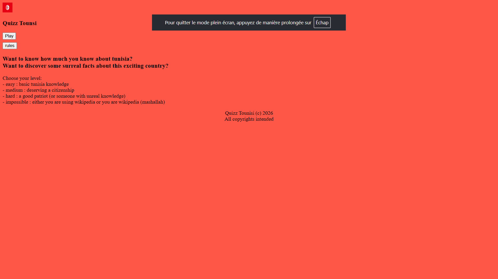
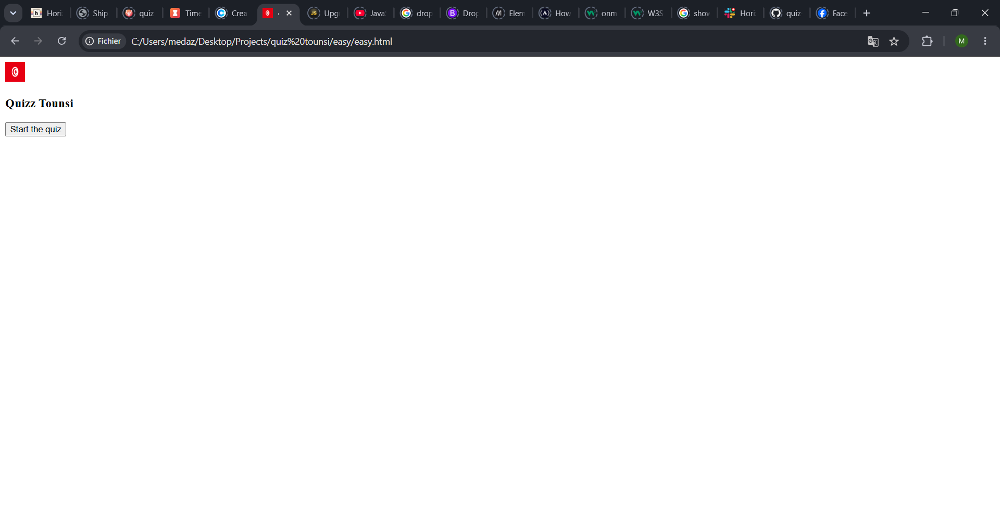
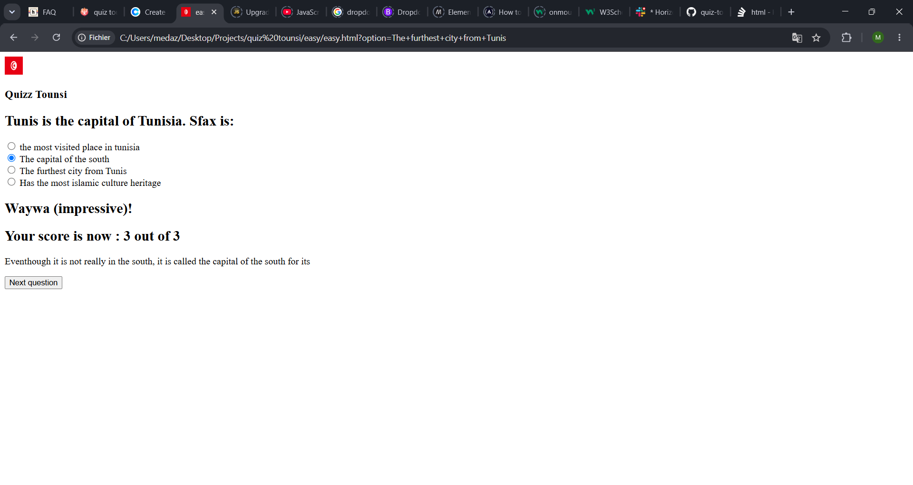

# June 20th: Menu

I made the skeleton of the website and chose the background color. 
Then I made buttons for each level that drop when you hover on the play button. 
It took too much time because I had to learn how to use functions.

**Total time spent: 2h 24m 46s**

# June 21st : Fonctionnal menu & beginning to make the quiz

I made an info button to know about the quiz and linked all the levels to their respective pages. Now that the menu is done (except for the styling part which I am leaving to the end), I went to build the HTML skeleton of the "easy" page and started with the javascript.

**Total time spent: 1h 2m 59s**

# June 22nd : Making the quiz work

I added a lot of paragraphs and titles concerning the results for each question. I also completed the load question function and made it functionnal (lol). Besides that, I added a verification function that compares the answer you selected with the correct one and updates your score, makes comments and explains each answer. I then had to make a 'next question' button, because when I added other questions (for testing so don't laugh at their stupidity ToT), it sticks to the same question. In summary, a lot of '.style.display's, a lot of constants and a LOT of errors later, the quiz is somewhat functionning! 

**Total time spent: 1h 48m 13s**